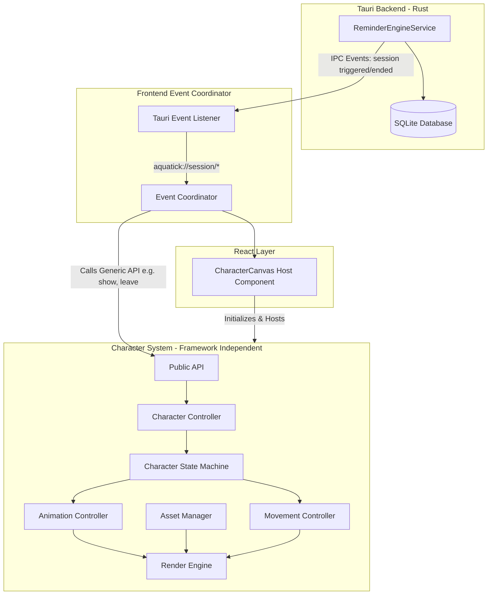
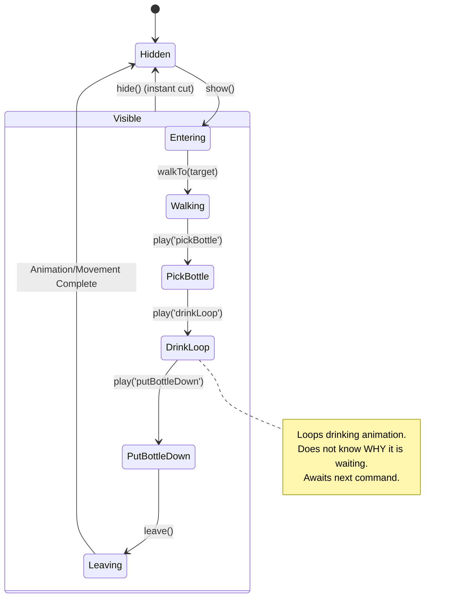
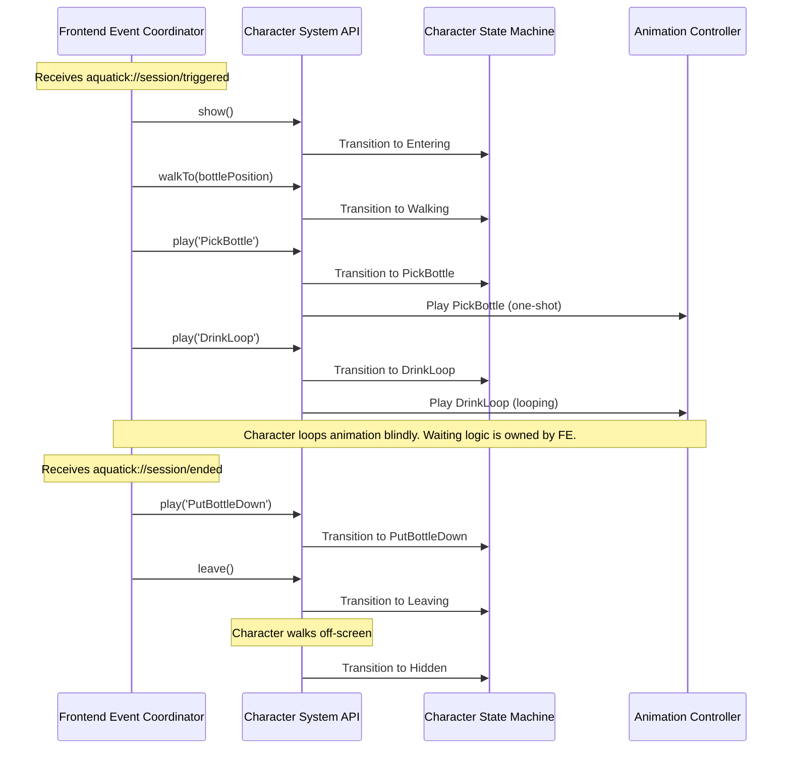
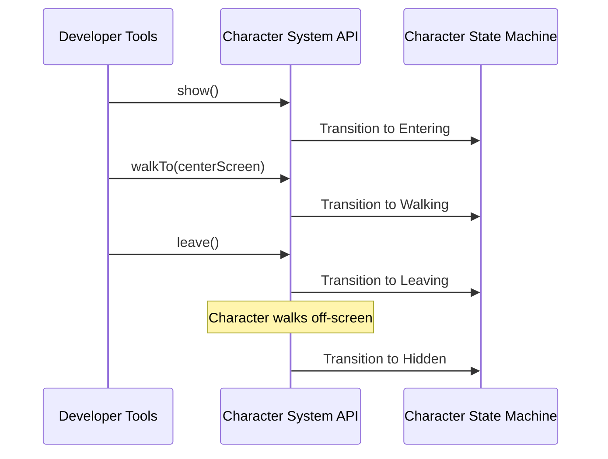
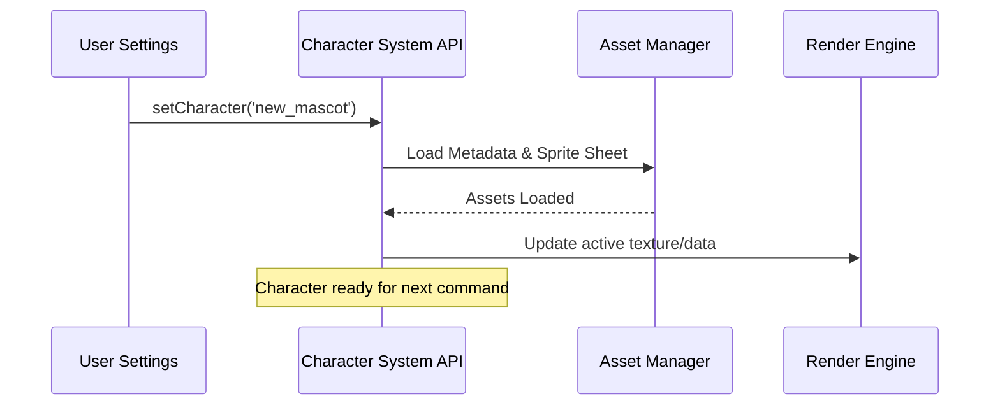

# AquaTick — Phase 5A: Character System Architecture Design Document

This document defines the architecture, components, state machines, public interfaces, and integration patterns for **Phase 5A: Character System** in AquaTick.

---

## 1. Purpose

The Character System is the core gamification driver of AquaTick. It provides the visual mascot (Cute 2D character) that guides the user through their hydration habits. By visually reacting to reminder states—entering when a reminder is due, drinking, and walking away when a session resolves—the character forms a positive feedback loop that encourages real-life drinking behavior.

---

## 2. Design Goals

- **Strict Decoupling**: Keep the Character System entirely independent of reminder timers, scheduling, databases, active usage state, or sound systems.
- **Framework Independence**: The Character System must never depend on React. React simply hosts the renderer.
- **Aesthetic Excellence**: Establish a responsive, premium rendering environment that supports vibrant, frame-rate independent animations.
- **Visual Robustness**: Use an isolated internal state machine to prevent frame glitches, sliding effects, or invalid state overlaps.
- **Dynamic Asset Configuration**: Read character metadata (frames, rows, animation states, scale offsets) dynamically from JSON descriptors to easily support new character additions in the future.
- **Performant Lifecycle**: Prevent background battery drain by pausing render tickers when the character is hidden or idle.

---

## 3. Responsibilities

The Character System is responsible for:
1. **Asset Management**: Loading assets (sprite sheets, metadata, expressions, icons) and parsing matching JSON animation metadata.
2. **Animation Playback**: Ticking frames, resolving playback loops vs. one-shot transitions, and maintaining the target FPS.
3. **Movement & Positioning**: Movement interpolation ($x, y$) for walks, entry, and exits.
4. **Rendering**: Drawing the correct sprite frame via the Render Engine.
5. **State Tracking**: Managing internal visual states (Hidden, Entering, Walking, PickBottle, DrinkLoop, PutBottleDown, Leaving).
6. **Public API Expose**: Offering generic methods (`show`, `walkTo`, `play`, `leave`, `hide`, etc.) for external orchestrators.

---

## 4. Non-Responsibilities

The Character System is **not** responsible for:
1. **Reminder Scheduling**: Deciding *when* a reminder triggers.
2. **Session Persistence**: Storing or updating database records.
3. **IPC Listening**: Direct monitoring of Tauri back-end events or database state.
4. **Audio**: Playing reminder alarm sounds.
5. **Settings Configuration**: Persisting selected user scale configurations (Small/Medium/Large).
6. **Orchestration/Waiting Logic**: The system does not wait for reminders to end. It simply loops the current animation until a new command is received from the Frontend Event Coordinator.

---

## 5. High-Level Architecture

The system achieves complete decoupling using a **Wiring Layer (Frontend Event Coordinator)**. The Character System itself has zero dependencies on Tauri or the Reminder Engine. Furthermore, the Character System is framework-agnostic; the React layer merely hosts it.



---

## 6. Internal Components

The Character System consists of the following internal components:

1. **Character Controller**: The main entry point that implements the public API and orchestrates the internal components.
2. **Character State Machine (CSM)**: An internal engine enforcing visual transitions and maintaining deterministic states.
3. **Animation Controller**: Manages delta-time ticks to swap frame indexes according to the current animation metadata.
4. **Movement Controller**: Updates character coordinates using movement interpolation to glide the character smoothly.
5. **Asset Manager**: Handles preloading, caching, and coordinate mappings of all character assets (sprite sheets, metadata, etc.).
6. **Render Engine**: A generic abstraction for drawing frames, allowing future swapping of underlying rendering technologies (Canvas, WebGL, PixiJS).

---

## 7. Component Responsibilities

| Component | Key Responsibility | Execution Detail |
| :--- | :--- | :--- |
| **Character Controller** | API surface and orchestration. | Receives API calls, delegates to CSM, Movement, and Animation controllers. |
| **Character State Machine** | Deterministic state management. | Prevents invalid transitions. Ensures one clear trigger per transition. |
| **Animation Controller** | Frame management. | Maps current time to frame indices based on FPS and delta-time. |
| **Movement Controller** | Positional updates. | Calculates positional offsets based on speed, delta-time, and movement interpolation. |
| **Asset Manager** | Asset lifecycle. | Preloads and caches textures and JSON metadata. |
| **Render Engine** | Visual output. | Clears and draws the current frame slice at the correct coordinates and scale. |

---

## 8. Character State Machine

The character transitions between internal visual states. This state machine is deterministic, with each transition having one clear trigger. It is **completely disconnected** from the reminder database status.



---

## 9. Public API

The Character System exposes a clean, single-responsibility public interface. No mention of sessions, schedules, or database states exists in this interface.

```typescript
interface CharacterSystemAPI {
  /**
   * Makes the character visible at the specified or default starting position.
   * Does NOT imply movement.
   */
  show(): void;

  /**
   * Instantly hides the character and aborts all pending animations or movement.
   */
  hide(): void;

  /**
   * Moves the character from their current position to target coordinates.
   * Resolves when destination is reached.
   */
  walkTo(x: number, y: number, speed?: number): Promise<void>;

  /**
   * Plays a specific animation by name (e.g., 'PickBottle', 'DrinkLoop').
   * The character will loop this animation until another command arrives.
   */
  play(animationName: string, options?: PlayOptions): Promise<void>;

  /**
   * Executes the leaving sequence (e.g., walking off-screen).
   * Resolves when the character is completely offscreen and hidden.
   */
  leave(): Promise<void>;

  /**
   * Updates the visual scale of the character viewport.
   */
  setScale(scale: 'small' | 'medium' | 'large'): void;

  /**
   * Changes the active character asset set dynamically.
   */
  setCharacter(characterId: string): Promise<void>;
}

interface PlayOptions {
  loop?: boolean;
  fps?: number;
  onFrame?: (frameIndex: number) => void;
}
```

---

## 10. Sequence Diagrams

### A. Reminder Triggered



### B. Developer Test Mode



### C. Change Character



---

## 11. Asset Specification

Every character requires assets located in the public assets directory:
1. **Spritesheet Texture (`spritesheet.png`)**: A grid sheet containing all animation rows.
2. **Metadata Descriptor (`character.json`)**: Configures widths, frame locations, and loop flags.

### Example Metadata Format

```json
{
  "characterId": "female_mvp_01",
  "name": "Aria",
  "meta": {
    "textureUrl": "assets/characters/aria/spritesheet.png",
    "frameWidth": 64,
    "frameHeight": 64,
    "totalRows": 4,
    "sourceScale": 2.0
  },
  "animations": {
    "walk": {
      "row": 0,
      "frameCount": 8,
      "fps": 12,
      "loop": true
    },
    "pickBottle": {
      "row": 1,
      "frameCount": 6,
      "fps": 10,
      "loop": false
    },
    "drinkLoop": {
      "row": 2,
      "frameCount": 12,
      "fps": 8,
      "loop": true
    },
    "putBottleDown": {
      "row": 3,
      "frameCount": 6,
      "fps": 10,
      "loop": false
    }
  }
}
```

---

## 12. Future Extension Points

- **Secondary Characters**: New characters (e.g. cute pets or male characters) can be introduced simply by loading a different `character.json` and sprite sheet through the `setCharacter()` API.
- **Audio Sync Triggers**: The `PlayOptions.onFrame` callback allows synchronizing sound effects (e.g. drinking gulps or walking footsteps) at exact frames without the Character System owning sound logic.
- **Transparent Desktop overlay widget**: By utilizing Tauri's transparent window configuration, this system can render on a borderless secondary screen overlay, making the character walk directly on the user's OS desktop.

---

## 13. Risks & Mitigations

| Risk | Impact | Mitigation Strategy |
| :--- | :--- | :--- |
| **Coordinate Glitches on Window Resize** | High | The character's target coordinates will use relative percentages rather than absolute pixels, re-anchoring correctly on viewport layout updates. |
| **Loading Stutter on First Trigger** | Medium | The frontend coordinator will run `setCharacter()` eagerly at app boot, pre-loading textures into browser memory. |
| **High Battery/CPU Consumption** | Medium | The render loop will sleep automatically when the state is `Hidden`, eliminating CPU cycles when off-screen. |

---

## 14. Architectural Decisions

1. **API Single Responsibility**: The public API strictly separates concerns. `show()` makes the character visible, while `walkTo()` handles movement. This prevents implicit, hard-to-track behaviors and keeps the API generic.
2. **Dynamic JSON Configuration**: Storing layout maps in JSON files instead of hardcoding row indices allows designers to update spritesheets directly without compiling TypeScript or Rust.
3. **Decoupled Controller (Wiring Layer)**: Centralizing Tauri event listeners in a separate `EventCoordinator` ensures that the Character System can be written and tested in isolation (e.g. in a Storybook/mock environment) with no Tauri dependency.

---

## 15. Deferred Features

- **Runtime Scaling**: The character scale is selected in Settings (Small, Medium, Large) and remains fixed during rendering. Fluid runtime size changes are deferred.
- **Dynamic Obstacle Avoidance**: The character walks in a straight horizontal line towards the bottle; custom paths or jumping over UI elements is deferred.
- **Skins & Outfits Layering**: Overlaying custom clothing sprites on the base character is deferred.
