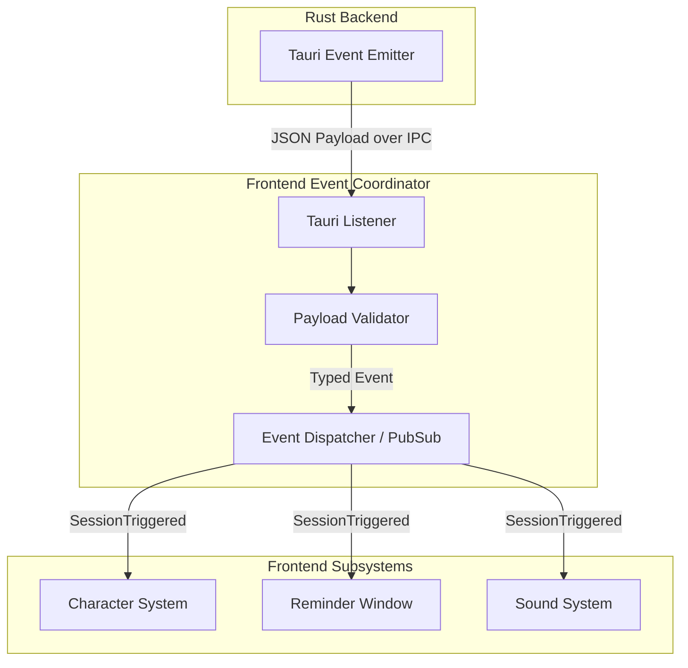

# Phase 5B: Rust ↔ Frontend Event Coordinator (Event Bridge) Architecture

## 1. Purpose
The Event Coordinator (also known as the Event Bridge) is the central communication nervous system of the AquaTick frontend. It is responsible solely for securely capturing IPC events emitted by the Rust (Tauri) backend, validating their payloads, and routing them to the appropriate frontend sub-systems (such as the Character System, Sound System, and Reminder Window) without containing any domain-specific business logic.

## 2. Design Goals
* **Completely Decoupled**: The bridge must not depend on the internal logic of the systems it connects.
* **Framework Independent**: The bridge is pure TypeScript and strictly avoids any React coupling. React or other frameworks may consume the bridge, but the bridge never knows about them.
* **Strong Typing**: All IPC payloads crossing the Rust/TypeScript boundary must be strictly typed and validated at runtime.
* **Event-Driven**: The system relies on a reactive Pub/Sub model rather than polling.
* **Easy to Extend**: Adding a new event type should only require defining the type and payload signature, without changing the bridge's core logic.
* **Testable**: The bridge must allow for simulated event dispatching to test frontend components without requiring a running Rust backend.
* **Single Responsibility**: The bridge routes data; it makes no decisions based on that data.

## 3. Responsibilities
* **Listening to Backend Events**: Subscribing to Tauri's IPC event streams.
* **Validating Event Payloads**: Ensuring data received matches expected TypeScript schemas before forwarding.
* **Mapping Events**: Translating raw backend strings into strictly typed frontend event actions.
* **Dispatching Commands**: Forwarding valid events to registered frontend listener callbacks.
* **Subscription Lifecycle**: Managing attach/detach phases to prevent memory leaks in the frontend.
* **Cleanup**: Tearing down active listeners safely.

## 4. Non Responsibilities
* **Reminder Logic**: The bridge does not calculate when a reminder should trigger.
* **Scheduler / Database**: The bridge has no knowledge of timing or persistence.
* **Character Animation**: The bridge tells the system a reminder triggered, but does not tell the character *how* to animate.
* **Sound Playback**: The bridge forwards the event; the Sound System actually plays the audio.
* **Rendering / UI**: The bridge has no visual representation.
* **Business Decisions**: The bridge does not intercept or block events based on settings.

## 5. High-Level Architecture



## 6. Internal Components
1. **Bridge Core (`EventCoordinator.ts`)**: A pure TypeScript singleton that maintains the map of active subscriptions and handles the actual Tauri `listen()` calls.
2. **Payload Validator (`validators.ts`)**: A schema layer (e.g., Zod) that parses unknown JSON payloads from the IPC layer into typed TypeScript interfaces.
3. **Mock Adapter (`MockCoordinator.ts`)**: A development utility that allows the frontend to dispatch events to itself for testing UI without compiling the Rust backend.

## 7. Component Responsibilities
* **Bridge Core**: Owns the generic Pub/Sub dictionary (`Record<EventType, Callback[]>`). Maps `emit()` and `on()`/`off()` operations.
* **Payload Validator**: Acts as the border patrol. If an event payload is malformed, it catches the error, logs it, and stops propagation.
* **Mock Adapter**: Injects dummy payloads into the Bridge Core for rapid prototyping.

## 8. Event Flow
1. **Backend** executes `app.emit_all("session:triggered", payload)`.
2. **Bridge Core (Listener)** receives the raw event asynchronously.
3. **Validator** parses the payload against the `SessionTriggeredPayload` schema.
4. **Bridge Core (Dispatcher)** loops through all active callbacks registered for `session:triggered`.
5. **Frontend Systems** receive the typed payload and execute their domain-specific logic (e.g., Character begins walking).

## 9. Public API

### Pure TypeScript API
```typescript
interface EventCoordinatorAPI {
  // Registers a callback for an event and returns an unsubscribe function
  on<T extends EventType>(
    event: T, 
    handler: (payload: EventPayload<T>) => void
  ): UnsubscribeFn;

  // Unregisters a specific handler
  off<T extends EventType>(
    event: T, 
    handler: (payload: EventPayload<T>) => void
  ): void;

  // Initializes the global listeners to Tauri
  initialize(): Promise<void>;
  
  // Cleans up all listeners
  destroy(): void;
}
```

## 10. Event Definitions
Events will be mapped to a strict type dictionary.

| Event Type (Key) | Payload Interface | Description |
| :--- | :--- | :--- |
| `session:triggered` | `{ sessionId: string, dueAt: string }` | Backend triggers an active reminder. |
| `session:completed` | `{ sessionId: string }` | User successfully drank water. |
| `session:snoozed` | `{ sessionId: string, durationMin: number }` | User delayed the reminder. |
| `session:timedOut` | `{ sessionId: string }` | User ignored the reminder. |
| `settings:changed` | `{ settings: AppSettings }` | Backend notifies frontend of config updates. |
| `character:changed`| `{ characterId: string }` | User selected a new character. |

## 11. Error Handling Strategy
* **Validation Failures**: If an incoming payload fails schema validation, the bridge will log a `console.error` with the validation details and **swallow the event**. It will not crash the frontend, nor will it forward corrupted data to subsystems.
* **Handler Exceptions**: Individual callback executions will be wrapped in `try/catch` blocks. If the Sound System throws an error handling an event, it will be caught and logged, ensuring the Character System and Reminder Window still receive their notifications.
* **IPC Connection Failures**: Initialization failures will immediately throw a descriptive error. The Event Bridge is infrastructure, not a networking layer, so it will not attempt automatic retries or exponential backoffs.

## 12. Lifecycle
1. **App Mount**: The root application calls `EventCoordinator.initialize()`. The bridge sets up broad Tauri listeners for all registered event categories.
2. **Consumer Subscription**: A frontend feature calls `on(eventType, handler)`.
3. **Runtime**: Events flow from backend to subscribers.
4. **Consumer Unsubscription**: The feature calls the `off(eventType, handler)` function when it no longer needs the events.
5. **App Unmount**: `EventCoordinator.destroy()` is called, tearing down all active Tauri listeners.

## 13. Future Extension Points
* **New Event Types**: Adding a new event requires exactly two lines of code: adding the key to the `EventType` enum/union, and defining its `Payload` interface. The bridge's routing logic remains untouched.
* **Cross-Window Communication**: If AquaTick expands to multi-window architectures, the bridge can act as the abstraction layer for window-to-window messaging via Tauri.

## 14. Risks
* **Memory Leaks**: The biggest risk in event-driven frontend systems is consumers failing to call `off()` when they are destroyed, leading to orphaned callbacks and duplicated logic execution. Proper architectural discipline is required when integrating frontend sub-systems.
* **Type Desynchronization**: If the Rust struct changes but the TypeScript payload interface isn't updated, the validator will drop the events silently. This requires discipline in maintaining the shared schema.

## 15. Architectural Decisions
1. **Centralized Listener vs. Distributed Listeners**: Rather than having every consumer call Tauri's `listen()` directly, the Event Coordinator maintains a single Tauri listener per event type and distributes the payloads internally. This dramatically reduces IPC overhead and simplifies cleanup.
2. **Runtime Validation**: We will use a runtime schema validator (like Zod) instead of trusting TypeScript types. Data crossing the IPC boundary is functionally "external API data" and must be verified before entering the application logic.

## 16. Deferred Features
* **Two-Way Bridge (Frontend -> Backend)**: This phase focuses purely on receiving events *from* the backend. Invoking backend commands (Frontend -> Backend) is handled via direct Tauri `invoke` calls and does not require the Event Coordinator.
* **Event Replay / History**: The bridge will not store a history of past events. If a component subscribes *after* an event has fired, it will miss it. (State synchronization should be handled by fetching current state, not replaying events).
