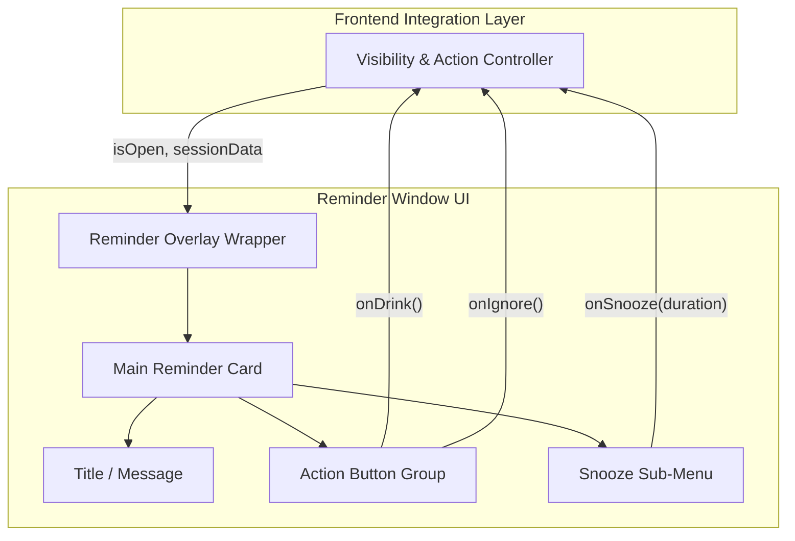

# Phase 5C: Reminder Window Architecture

## 1. Purpose
The Reminder Window is a pure presentation component responsible for rendering the visual interface that prompts the user to drink water. It acts as the primary user interaction surface during an active reminder session, capturing user intent (Drink, Snooze, Ignore) and delegating those actions outward. It remains completely devoid of business logic, acting strictly as a "dumb" UI component controlled by its host.

## 2. Design Goals
* **Dumb Component Pattern**: The window must receive its state and action callbacks via properties. It must not make decisions about *when* to show or *how* to handle the data.
* **Highly Reusable**: The UI components (buttons, layout) should be designed so they could theoretically be dropped into any other React context without modification.
* **Accessible (a11y)**: Must support keyboard navigation (Tab/Enter) and screen reader friendly labels.
* **Visual Polish**: Smooth entrance/exit transitions and clear interactive states (hover, active, disabled).
* **Isolation**: The component should not reach out directly to the backend, the Event Coordinator, or the Character System.

## 3. Responsibilities
* **Window Layout**: Managing the CSS structure, positioning, and responsive constraints of the reminder overlay.
* **Reminder UI**: Rendering the core message, countdowns (if any), and decorative UI elements.
* **Action Buttons**: Providing the interface for "Drink", "Snooze", and "Skip/Ignore" actions.
* **Visual States**: Handling local UI states such as button hover effects, loading spinners during action processing, or expanding snooze menus.
* **User Interaction**: Capturing clicks, taps, and keyboard events and translating them into intent callbacks.

## 4. Non Responsibilities
* **Reminder Scheduling**: It does not know *when* the next reminder is due.
* **Reminder Engine / Backend**: It does not invoke Tauri backend commands or save data to the database.
* **Character Animation**: It does not trigger or control the Character System.
* **Sound System**: It does not play audio.
* **Statistics**: It does not track or calculate user hydration streaks.
* **Business Logic**: It does not decide if a snooze is allowed.

## 5. High-Level Architecture



## 6. Internal Components
1. **`ReminderOverlay.tsx`**: A full-screen invisible wrapper that centers the card and manages entrance/exit animations.
2. **`ReminderCard.tsx`**: The main container for the UI layout, providing the background, shadows, and structure.
3. **`ButtonGroup.tsx` / `ActionButton.tsx`**: Reusable button primitives for the Drink/Ignore primary and secondary actions.
4. **`SnoozeSelector.tsx`**: A specific sub-component that reveals options for delaying the reminder (e.g., 5 min, 15 min).
5. **`useReminderUI.ts`**: A local custom hook specifically for managing pure UI state (like toggling the snooze menu visibility).

## 7. Component Responsibilities
* **`ReminderOverlay`**: Prevents underlying clicks (if blocking mode is on) and handles CSS transitions (`opacity`, `transform`).
* **`ReminderCard`**: Organizes layout flex/grid structures.
* **`ActionButton`**: Manages interactive states (hover, focus, disabled, loading).
* **`SnoozeSelector`**: Manages the local state of whether the snooze duration options are expanded or collapsed.

## 8. UI State Machine
While business logic is external, the UI has its own local, transient visual state:
* **`HIDDEN`**: Not rendered in the DOM (or fully transparent/translated off-screen).
* **`ENTERING`**: CSS animation playing to reveal the card.
* **`IDLE`**: Awaiting user input.
* **`SNOOZE_MENU_OPEN`**: The user clicked "Snooze", revealing duration options.
* **`PROCESSING`**: The user clicked an action, and the UI is locked/loading while the host handles the request.
* **`EXITING`**: CSS animation playing to hide the card.

## 9. Public API

```typescript
export interface ReminderWindowProps {
  /** Determines if the UI should be visible */
  isOpen: boolean;
  
  /** Disables inputs to show a loading state while processing */
  isProcessing: boolean;
  
  /** Called when the user clicks 'Drink Water' */
  onDrink: () => void;
  
  /** Called when the user selects a snooze duration */
  onSnooze: (durationMinutes: number) => void;
  
  /** Called when the user dismisses the reminder without drinking */
  onIgnore: () => void;
}

export const ReminderWindow: React.FC<ReminderWindowProps>;
```

## 10. Interaction Flow
1. **Host** renders `<ReminderWindow isOpen={true} />`.
2. **User** clicks the "Snooze" button.
3. **UI** locally expands the `SnoozeSelector`.
4. **User** selects "15 Minutes".
5. **UI** calls `onSnooze(15)`.
6. **Host** receives the callback, triggers backend logic, and sets `isProcessing={true}`.
7. **UI** disables all buttons and shows a spinner.
8. **Host** finishes processing and sets `isOpen={false}`.
9. **UI** plays exit animation.

## 11. Future Extension Points
* **Theming**: Easily swap out colors/styles via CSS variables or theme providers.
* **Custom Snooze Durations**: Allow the host to pass in an array of `availableSnoozeDurations`.
* **Dynamic Messaging**: Accept a `message` or `title` prop to change the text dynamically based on time of day.

## 12. Risks
* **Z-Index Conflicts**: The overlay must correctly sit above or below the Character Canvas depending on the desired visual layering.
* **Focus Trapping**: In an overlay, keyboard focus should ideally be trapped inside the card so users don't tab into invisible background elements.
* **Stale State**: If the backend times out, the `isProcessing` state could hang indefinitely. The host layer must ensure UI un-locking on errors.

## 13. Architectural Decisions
* **Strict "Dumb" Componentization**: We are intentionally keeping `EventCoordinator` subscriptions *out* of this component. Integrating the Coordinator and Backend Commands will be handled entirely in Phase 5D (Frontend Integration) to maximize testability and reusability of the UI code.
* **CSS-driven Animations**: Transitions will be handled via CSS classes rather than heavy JS animation libraries to keep the bundle small and performance high.

## 14. Deferred Features
* **Event Coordinator Subscription**: Deferred to Phase 5D.
* **Tauri Backend Invocation**: Deferred to Phase 5D.
* **Sound Triggers**: Deferred to Phase 5E.
